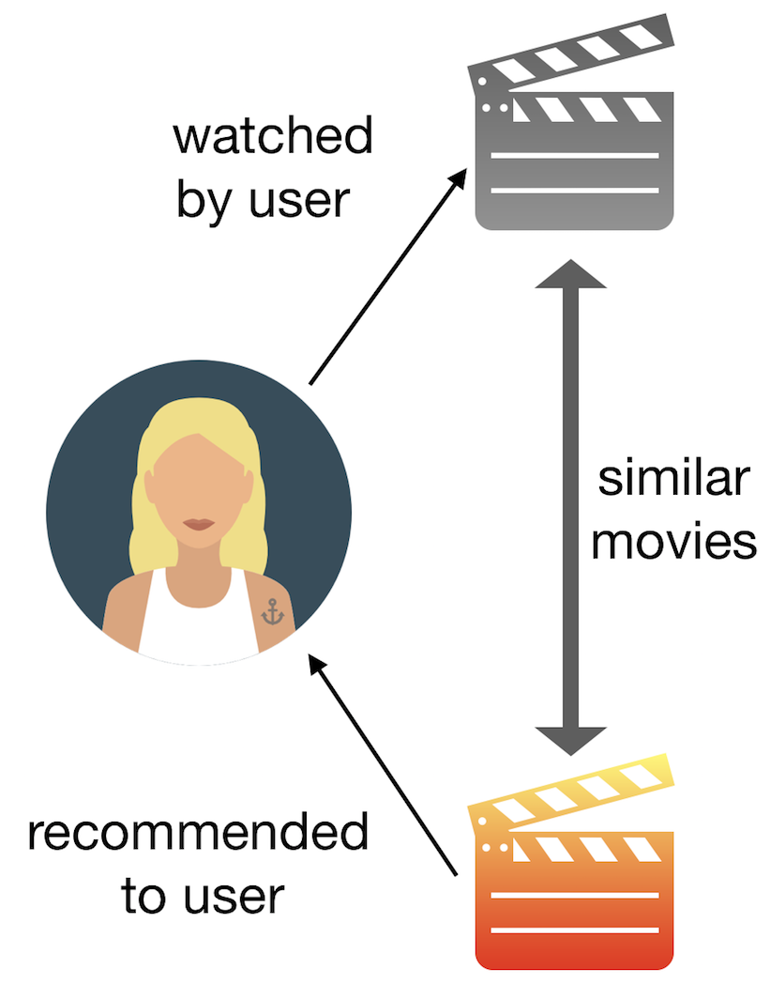
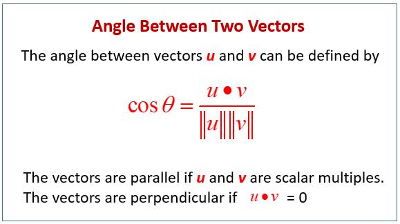

# 🎬 Movie Recommendation System

A hybrid Content-Based and Collaborative Filtering recommender system that suggests movies based on user preferences, viewing history, and item similarity.

Built with Python, leveraging Flask for the web interface and popular machine learning libraries for recommendation logic.

## 📌 Features 

**1) Content-Based Filtering**

- Recommends movies similar to the ones a user already liked/watched.
- Uses Cosine Similarity on text-based metadata (e.g., genres, descriptions).

**2) Collaborative Filtering**

- Suggests movies based on other users with similar tastes.

**3) Hybrid Approach**

- Combines both methods for more accurate and personalized recommendations.

**4) Web Application**

- Interactive UI built with Flask.
- Easy to run locally.

## 📊 Dataset

We used two datasets for building and testing the recommender:

### **1) IMDB 5000 Movie Dataset**

- Source: Kaggle
- Used for training and similarity computations.

### **2) MovieLens (ml-latest-small)**

- Contains 100,836 ratings and 3,683 tag applications across 9,742 movies.
- Source: GroupLens

### **⚠️ License Notice:**

The MovieLens dataset is provided for research purposes only, with restrictions on redistribution and commercial use. Please see the full license in the dataset documentation.

## ⚙️ Tech Stack

### **Languages & Libraries**

- Python, Pandas, NumPy, Scikit-learn
- Flask (for web app)

### **Dataset Handling**

- CSV-based data preprocessing
- Cosine similarity for item-to-item recommendation

## 📂 Project Structure

Movie_Recommendation_System/
    │── preprocessing.ipynb    # Data preprocessing steps  
    │── create.py              # Generates data.csv and similarity matrix  
    │── main.py                # Flask app entry point  
    │── templates/             # HTML templates for Flask  
    │── static/                # CSS/JS/Images  
    │── dataset/               # MovieLens & IMDB datasets  
    │── README.md              # Project documentation  

## 🚀 Getting Started

### **Prerequisites**

Make sure you have Python 3.7+ installed. Then install the required dependencies:

    pip install -r requirements.txt

Run the Application

    python main.py

Open your browser and visit:
👉 http://127.0.0.1:5000/

## 📸 Screenshots for Reference

### Flow of code

Similarity Score :It is a numerical value ranges between zero to one which helps to determine how much two items are similar to each other on a scale of zero to one. This similarity score is obtained measuring the similarity between the text details of both of the items. So, similarity score is the measure of similarity between given text details of two items. Here we’ll use cosine similarity between text details of items. In the example below it is shown how to get cosine similarity:

### Cosine

## 👨‍💻 Contributors

    Ujjwal Gupta

    Ziaul Kadri

    Supriya Kumari Gupta

    Himanshi Kumari Gupta

## 📜 License

This project is open-sourced under the MIT License.
Datasets are subject to their respective licenses:
- MovieLens License (http://grouplens.org/datasets/movielens/?utm_source=chatgpt.com)
- IMDB Dataset License (Kaggle) (https://www.kaggle.com/carolzhangdc/imdb-5000-movie-dataset?utm_source=chatgpt.com)

